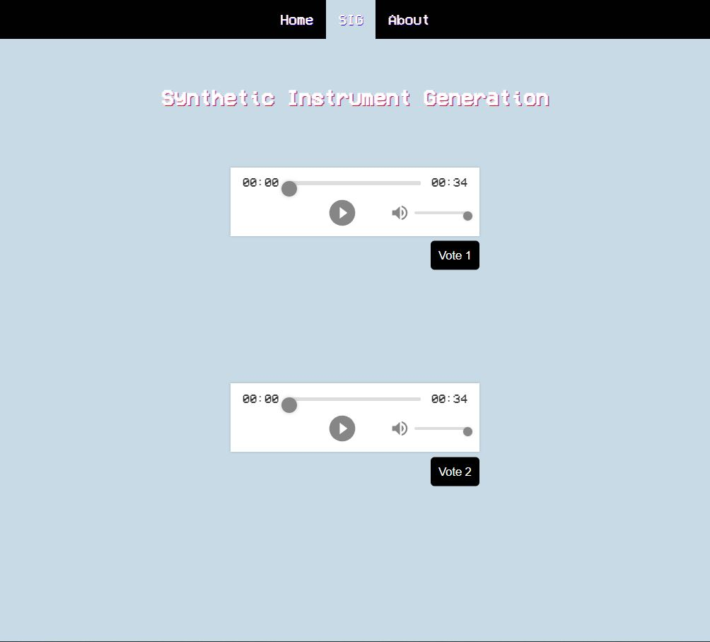

To host website using React install flask & run these commands to install used packages.

# Currently Outdated

# React:

``` npm install ```

```npm install framer-motion```

```npm install react-h5-audio-player```

# Flask:

``` $env:FLASK_APP="webapp.py" ``` 

``` py -m flask run ```


